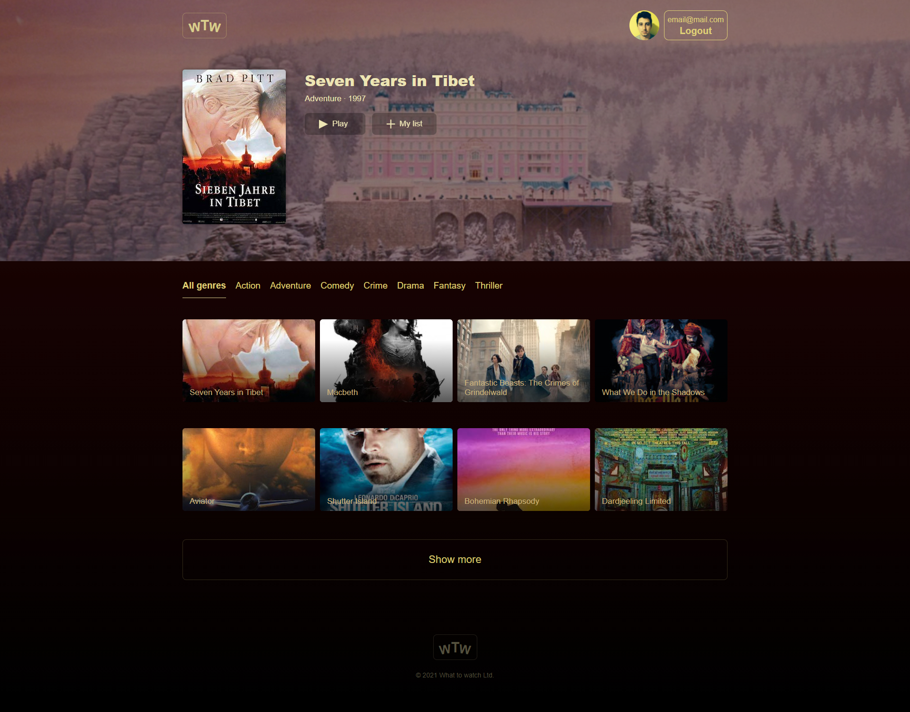
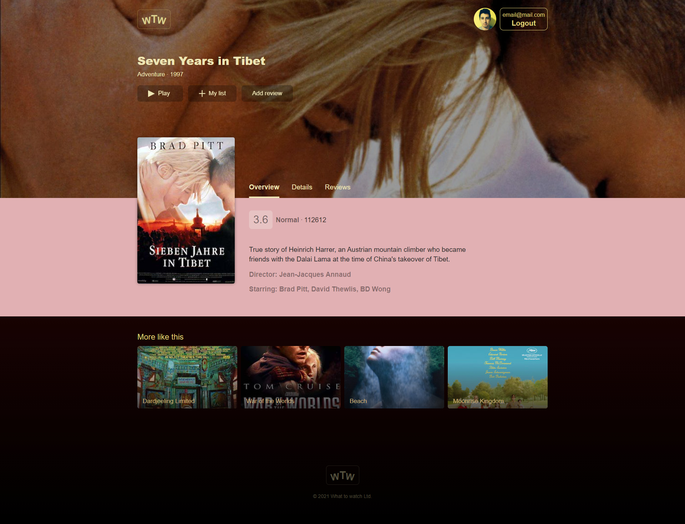
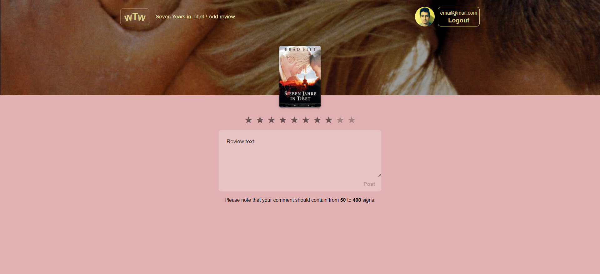

# Личный проект «Что посмотреть»

### Описание

The project was carried out as part of training on the online-course of HTML Academy (htmlacademy.ru) 'React. Development of Complex Front-end Applications'. The main used technologies stack includes:

- JavaScript(ES6)
- React (hooks), React-router-dom
- Redux, React-redux, Redux-thunk
- Axios
- Jest
- Webpack

The screenshots are presented below:

